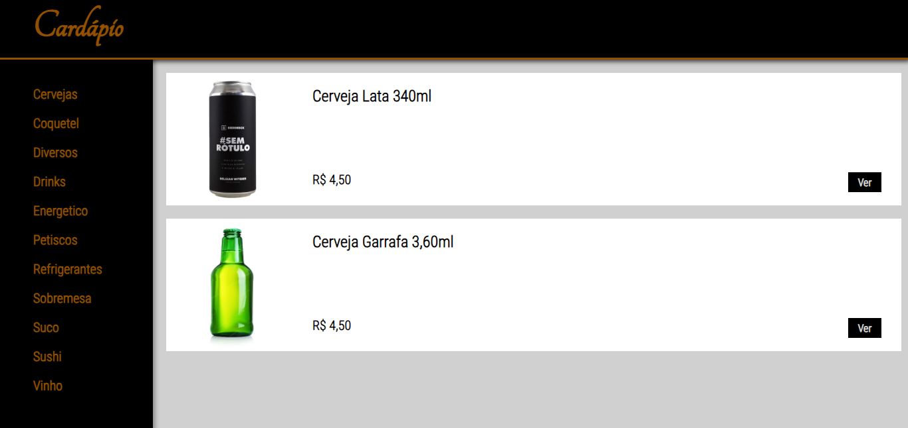
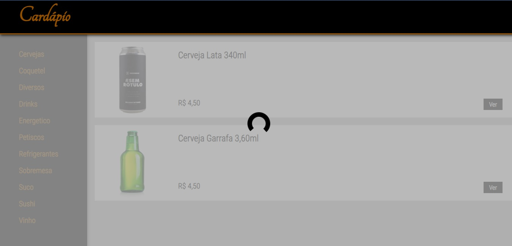
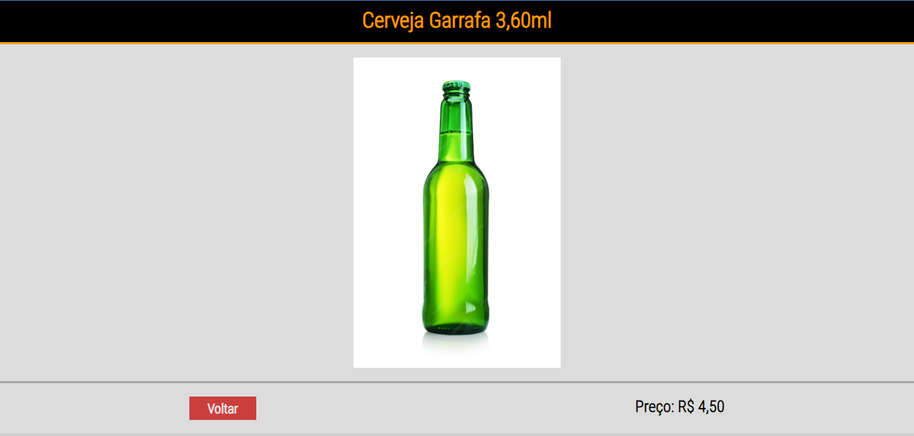
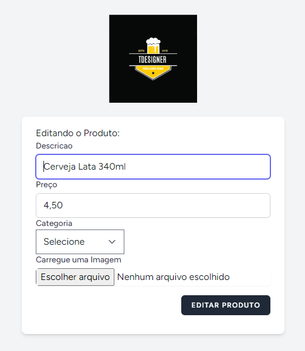
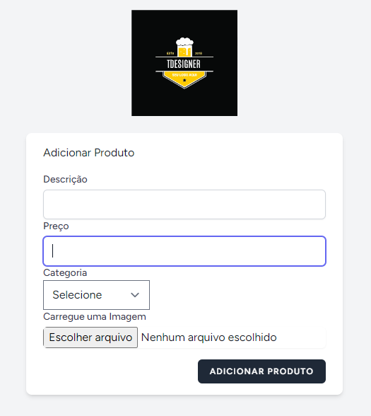
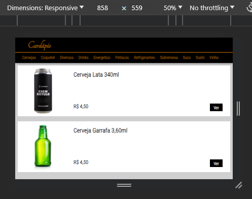

# Sistema de Cardápio

## Sobre o Projeto

Projeto criado no intuito de desenvolver minhas habilidades com PHP/Laravel, foi desafiador tive algumas dificuldades para implementar o Jetstream, mas com muita pesquisa e a documentação necessária foi possível tirar todas as minhas dúvidas e resolver os "bugs", eu meio que mudei da água para o vinho mas foi muito divertido e estou amando o Framwork Laravel, tenho a certeza que ainda vou aprender muito mais a respeito, e vou implantar nos futuros projetos, e este, apesar de ser um projeto voltado mais para adquirir conhecimento em Laravel, pretendo melhorá-lo e colocar para rodar em breve.

## Tecnologias utilizadas
**Frond-end**: HTML, CSS, Laravel, Livewire e JavaScript.  
**Back-end**: PHP/Laravel, MySql e o Pacote Open Source.

## Autor
-[Julio Reis]()

## Resuldatados de Conclusão

